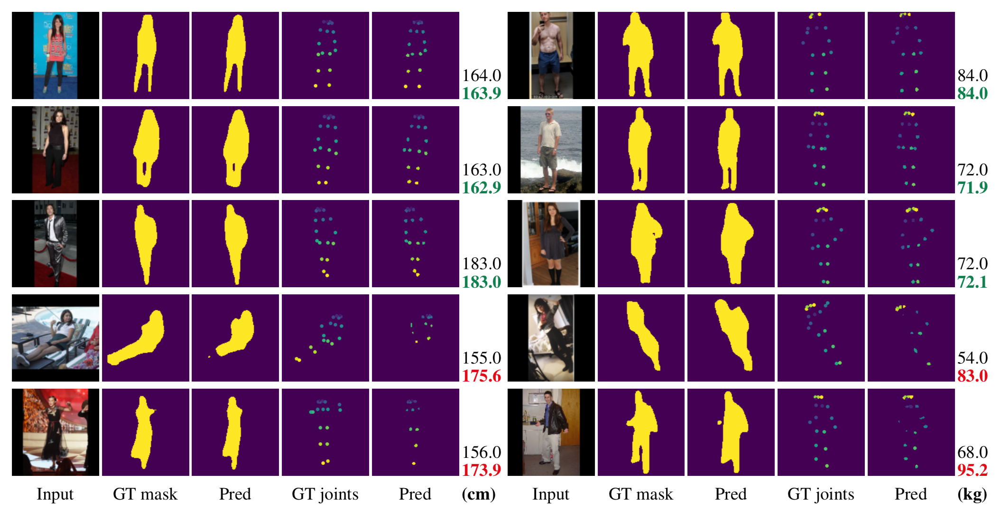

# Height and Weight Estimation From Unconstrained Images

We address the difficult problem of estimating the attributes of weight and height of individuals from pictures taken in completely unconstrained settings. We present a deep learning scheme that relies on simultaneous prediction of human silhouettes and skeletal joints as strong regularizers that improve the prediction of attributes such as height and weight. Apart from imparting robustness to the prediction of attributes, our regularization also allows for better visual interpretability of the attribute prediction. For height estimation, our method shows lower mean average error compared to the state of the art despite using a simpler approach. For weight estimation, which has hardly been addressed in the literature, we set a new benchmark. **(**_Accepted to [IEEE ICASSP 2020](https://2020.ieeeicassp.org)_**)**

## Trained Models in the Original Paper

Each file is nearly 2GB. Just download them and put them in `/models` folder.
- Pretrained Height Network: [https://drive.google.com/open?id=1fX0DDgbTcOOmiz9KdtU7I2YYg5S49upj](https://drive.google.com/open?id=1fX0DDgbTcOOmiz9KdtU7I2YYg5S49upj)
- Pretrained Weight Network: [https://drive.google.com/open?id=14ShT0rsUohiGT0wJlKY9cGHgEy0w4Ity](https://drive.google.com/open?id=14ShT0rsUohiGT0wJlKY9cGHgEy0w4Ity)

## Usage

In order to train height network, run `train.py`. For weight network run `train_weight.py`. Instructions are given as comment lines in the header. You can find the performance of models on height and weight estimation test sets in `Results_HW.ipynb` notebook.

## Environment

You can use `environment.yml` file to create a Conda environment to run experiments. You can create a new environment using this command. `conda env create -f environment.yml -p [PATH]`

## Weight Dataset

We will soon share the weight dataset that we created and used in our experiments.
